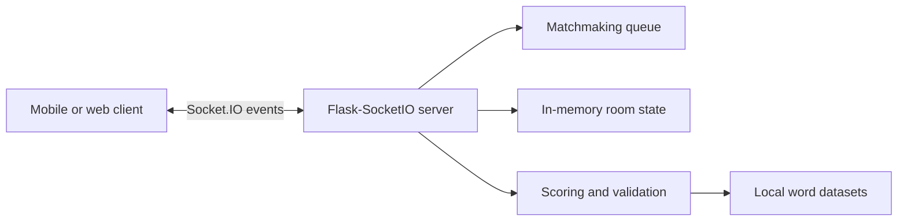

# Realtime Name-City Prototype

An early real-time multiplayer backend built to explore online **Name–City**
gameplay before the mobile version, **İsim Şehir Arena**, was developed.

The project uses Flask and Socket.IO to coordinate matchmaking, private rooms,
round state, chat, answer validation, scoring, and rematches. It is published as
a cleaned portfolio snapshot of the original learning prototype; there is no
active production service connected to this repository.

## What it demonstrates

- Real-time bidirectional communication with Socket.IO
- Automatic two-player matchmaking
- Password-protected rooms and host-controlled game settings
- Server-authoritative round state and scoring
- Category-based word validation using local datasets
- Room chat, rematch flow, and disconnect cleanup
- Environment-based configuration and automated tests

## Technology

- Python 3.12
- Flask
- Flask-SocketIO
- Gunicorn with a threaded worker
- Pytest
- GitHub Actions

## Architecture



The event contract retains its original Turkish names because the prototype
was designed for a Turkish Flutter client. Representative events include:

| Client event | Server response | Purpose |
| --- | --- | --- |
| `hemen_oyna` | `eslesme_tamam` | Match two waiting players |
| `oda_olustur` | `oda_katildi` | Create and join a private room |
| `oda_katil` | `oyuncular_guncellendi` | Join an existing room |
| `oyunu_baslat` | `yeni_oyun_basladi` | Start a round |
| `cevaplari_gonder` | — | Submit category answers |
| `oyunu_bitir` | `puan_durumu` | Validate and score the round |
| `sohbet_gonder` | `sohbet_al` | Send a room message |

## Run locally

```bash
python3 -m venv .venv
source .venv/bin/activate
pip install -r requirements-dev.txt
cp .env.example .env
```

Generate a local secret and paste it into `.env`:

```bash
python -c 'import secrets; print(secrets.token_urlsafe(32))'
```

Start the server:

```bash
python app.py
```

The health endpoints are then available at:

- `http://localhost:5000/`
- `http://localhost:5000/health`

## Configuration

| Variable | Required | Description |
| --- | --- | --- |
| `SECRET_KEY` | Production | Long random value used by Flask |
| `ALLOWED_ORIGINS` | No | Comma-separated browser origins; use explicit values in production |
| `PORT` | No | HTTP port, defaults to `5000` |
| `LOG_LEVEL` | No | Python logging level, defaults to `INFO` |

When `SECRET_KEY` is missing, the application generates an ephemeral
development key and logs a warning. This fallback should not be used for a
hosted deployment.

## Test

```bash
pytest -q
```

The included GitHub Actions workflow runs the same test suite on pushes and
pull requests.

## Deployment notes

The included `Procfile` uses one Gunicorn process with multiple threads:

```text
gunicorn --worker-class gthread --workers 1 --threads 100 app:app
```

A single worker is intentional because this prototype stores matchmaking and
room state in process memory. A production version should move shared state to
Redis or another external store before scaling to multiple workers.

## Security improvements in this public snapshot

- Secrets are read from environment variables instead of source code.
- Browser origins are configurable instead of being permanently unrestricted.
- Incoming names, room identifiers, answers, and messages are length-limited.
- Players can only interact with rooms they have joined.
- Disconnected players are removed from matchmaking and room state.

## Known limitations

- State is lost whenever the process restarts.
- The prototype does not include user accounts or persistent match history.
- Room passwords are simple join codes, not authentication credentials.
- Word datasets are local files and require editorial review for production use.
- The repository contains the backend prototype only; the later mobile product
  is maintained separately.

## Project background

This server began as an experiment in real-time web gameplay. The lessons from
its matchmaking, synchronized rooms, validation, and scoring flows later
informed the architecture of a published Flutter/Firebase mobile game. The
repository is kept public to document that progression and the engineering
decisions learned along the way.
